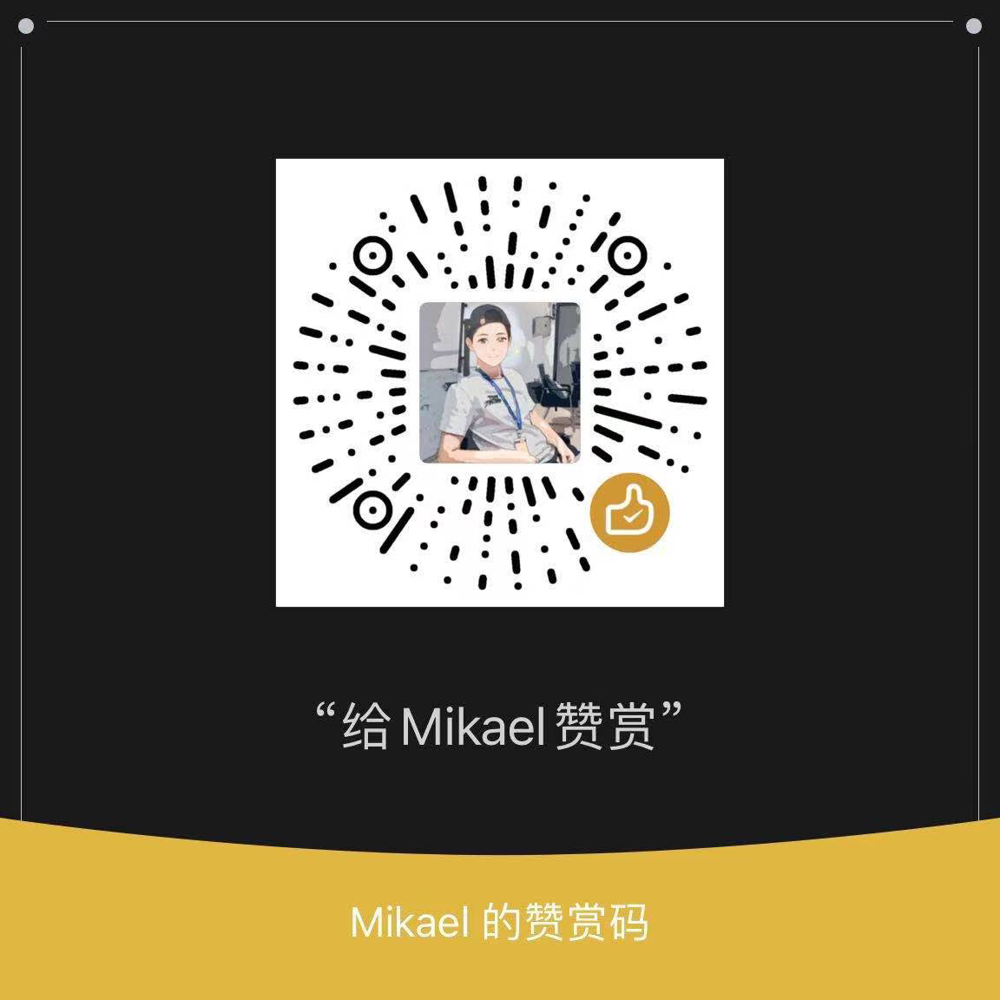

## 前言

#### 老规矩，看之前先给个star哈～～,不star被抓住要打屁股，哈哈哈哈哈哈

因为大家都在说目前go-zero没有一个完整的项目例子，本人接触go-zero可能比较早，go-zero在大约1000start左右我就在用了，后来跟go-zero作者加了微信也熟悉了，go-zero作者非常热心以及耐心的帮我解答了很多问题，我也想积极帮助go-zero推广社区，基本是在社区群内回答大家相关的问题，因为在这个过程中发现很多人觉得go-zero没有一个完整的项目例子，作为想推动社区的一员，索性我就把内部项目删减了一些关键东西，就搞了个可用版本开源出来，主要技术栈包含如下：

- go-zero

- nginx网关

- filebeat

- kafka

- go-stash

- elasticsearch

- prometheus
- grafana
- jager
- go-queue
- asynq
- dtm
- docker
- docker-compose

## 项目简介

整个项目使用了go-zero开发的微服务，基本包含了go-zero以及相关go-zero作者开发的一些中间件，所用到的技术栈基本是go-zero项目组的自研组件，基本是go-zero全家桶了
另外，前端是小程序，本项目已经对接好了小程序授权登录 以及 微信支付了 ，前端看看后面是否能开源吧

项目目录结构如下：

- app：所有业务代码包含api、rpc以及mq（消息队列、延迟队列、定时任务）

- common：通用组件 error、middleware、interceptor、tool、ctxdata等

- deploy：

    - script：

        - gencode：生成api、rpc，以及创建kafka语句，复制粘贴使用

        - mysql：生成model的sh工具

    - gateway:
        - nginx 的网关配置文件

- data：所有项目依赖的数据与配置 ， 开发时候记得将data目录在git中忽略，不然提交代码一大堆

    - sql：项目需要用到的sql文件

    - goctl : 该项目使用的goctl的template文件模版

    - elasticsearch：项目依赖es保存的数据与配置

    - grafana：项目以来grafana相关数据与配置

    - kafka：项目依赖kafka相关数据与配置

    - prometheus：项目依赖prometheus相关数据与配置

## 架构图

## 网关

nginx做网关，使用nginx的auth模块，调用后端的identity服务统一鉴权，业务内部不鉴权，如果涉及到业务资金比较多也可以在业务中进行二次鉴权，为了安全嘛。

另外，很多同学觉得nginx做网关不太好，这块原理基本一样，可以自行替换成apisix、kong等

## 开发模式

本项目使用的是微服务开发，api （http） + rpc（grpc） ， api充当聚合服务，复杂、涉及到其他业务调用的统一写在rpc中，如果一些不会被其他服务依赖使用的简单业务，可以直接写在api的logic中

## 日志

关于日志，统一使用filebeat收集，上报到kafka中，由于logstash懂得都懂，资源占用太夸张了，这里使用了go-stash替换了logstash

链接：https://github.com/kevwan/go-stash  ， go-stash是由go-zero开发团队开发的，性能很高不占资源，主要代码量没多少，只需要配置就可以使用，很简单。它是吧kafka数据源同步到elasticsearch中，默认不支持elasticsearch账号密码，我fork了一份修改了一下，很简单支持了账号、密码

## 监控

监控采用prometheus，这个go-zero原生支持，只需要配置就可以了，这里可以看项目中的配置

## 链路追踪

go-zero默认jaeger、zipkin支持，只需要配置就可以了，可以看配置

## 消息队列

消息队列使用的是go-zero开发团队开发的go-queue，链接：https://github.com/zeromicro/go-queue

这里使用可kq，kq是基于kafka做的高性能消息队列

通用go-queue中也有dq，是延迟队列，不过当前项目没有使用dq

## 延迟队列、定时任务

延迟队列、定时任务本项目使用的是asynq ， google团队给予redis开发的简单中间件，

当然了asynq也支持消息队列，你也可也把kq消息队列替换成这个，毕竟只需要redis不需要在去维护一个kafka也是不错的

链接：https://github.com/hibiken/asynq

## 分布式事务

分布式事务准备使用的是dtm， 嗯 ，很舒服，之前我写过一篇 "go-zero对接分布式事务dtm保姆式教程" 链接地址：https://github.com/Mikaelemmmm/gozerodtm ， 本项目目前还未使用到，后续准备直接集成就好了，如果读者使用直接去看那个源码就行了

## 部署

部署的话，目前这个直接使用docker可以部署整套技术栈，如果上k8s的话 ，最简单直接用阿里云的吧

我说下思路，这里就不详细描述了

1、将代码放在阿里云效（当然你整到gitlab也行）

2、在阿里云效创建流水线，基本是一个服务一个流水线了

3、流水线步骤 ：

​		拉取代码--->ci检测（这里可以省略哈，自己看着办）--->构建镜像（go-zero官方有Dockerfile还有教程，别告诉我不会）-->推送到阿里云镜像服务--->使用kubectl去阿里云k8s拉取镜像（ack、ask都行，ask无法使用daemonset 不能用filebeat）---->ok了

另外， 如果你想自己基于gitlab、jenkins、harbor去做的话，嗯 自己去找运维弄吧，我之前也写过一个教程，有空在整吧老哥们！！

## 赞赏

